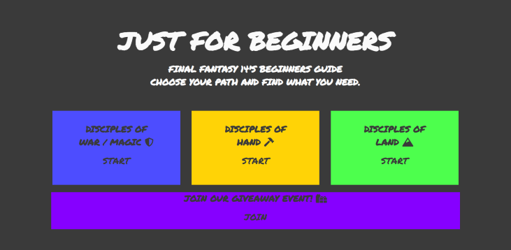
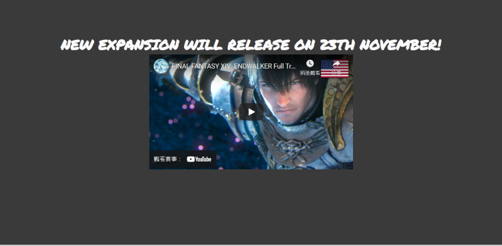
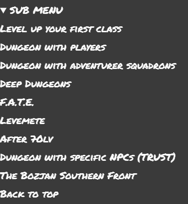
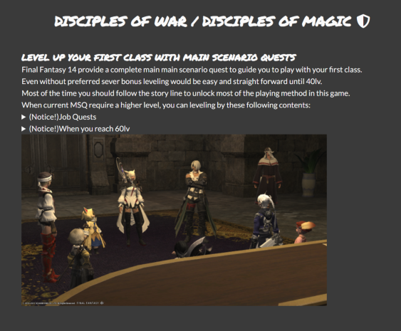
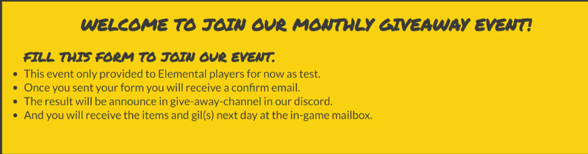
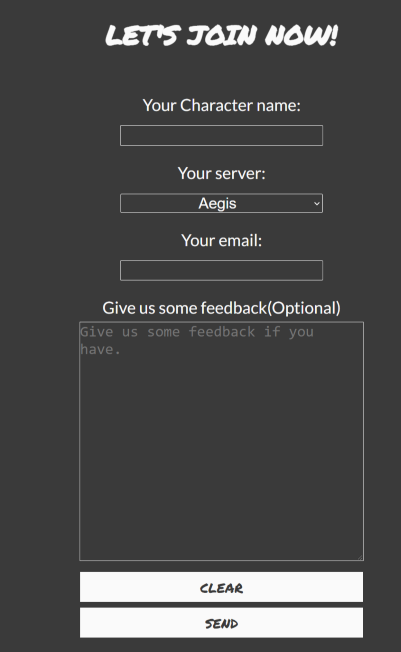
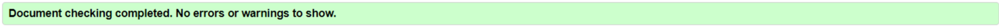

# Just for Begginers - Final Fantasy 14's Beginners Guide
# Milestone Project 1

## =Purpose=
FF14 is one of most well-known MMORPG in the world. And there are few different FF14 game database and many tools to fulfill their need. But there are too many information prepare to those new players. Instead of 'what I can do', 'what I should do first' are always be the first question to them. Some of them even never play any MMORPG or console game before. So this website will provide a simple guide to help those beginners.

## =Features=
### =Existing Features=
#### Landing Page
* Entrance section
  A section with four button within four rectangle to redirect user to other four pages.

  

* Trailer section
  This section shows a embedded video from youtube include user control and hyper link to open the video on youtube in a new tab.

  

* Footer
  This section include a e-mail link and four social media icons, if you click the icon the website will open the social media page in new tab.

  

#### Guides(doh.html, dow.html, dow.html)
The content and images may be different, but these three website build by the same structure.
* Navigation bar
  The navigation bar show the title on the left side, and four hyper link on the right side to allow user discover another pages in this website. If user enter the website by mobile, the navigation bar will arranged vertically.

  

* Sub-menu
  This section provide a sub-menu and internal links for user just want to read specific paragraph.

  

* Main content
  This section included the complete guide for specific type of class.

  

* Footer
  This section include a e-mail link and four social media icons, if you click the icon the website will open the social media page in a new tab.

  

#### Giveaway event register form
* This section also have a nevigator bar in header
* Introduction section
  This section shows the details user should know before they enter any information.

  

* Form seciton
  This section include a form with reset and submit button. User who can complete this form and send the required information to join our giveaway event in game. 

  

* Footer
  This section include a e-mail link and four social media icons, if you click the icon the website will open the social media page in a new tab.

  

### Features Left to Implement
* Add a beginners guide in eureka, a up to 144 players instanced area release in 4.0 expansion.
* Add a complete gold saucer beginners guide.
* Add a house purchasing and furnish guide.

## =Testing=
* All things have been tested in different screen sizes, only in galaxy fold will be invalid.
* All links have been checked and direct to the correct pages.
* All links to external websites open in a new browser.
* All buttonanimation in index.html and the nav bar are functional when user hover over the link.
* Video in index.html is functional and responsive.
### Validator Testing
Following test are using [HTML - W3C HTML Validator](https://validator.w3.org/) and [CSS - Jigsaw CSS Validator]().
#### HTTP test
All script have been tested without important error.

#### CSS test
index.css and style.css both pass are all passed test.

#### Lighthouse

### Unfixed Bugs

## =Deployment=
The website use git for version control, and deploy in Github by following step:

* This website create from Code Institue [template for Gitpod](https://github.com/Code-Institute-Org/gitpod-full-template).
* Every change in this project commit by the VS Code source control function.
* git push command was used to push all committed changes to the GitHub repository.
* When the website almost complete, I login to my GitHub Repository Setting page.
* In the Page section I click the dropdown list under "Scource" and select "main".
* At last I deploy the website after press the "Save" button.

## =Credits=
### Content
  Contents and information are come from:
* [Gamer Escape](https://ffxiv.gamerescape.com/wiki/Main_Page)
* [FFXIV Wiki](https://ffxiv.consolegameswiki.com/wiki/FF14_Wiki)
* And modify with my personal opinion

### Images
* All images are all Final Fantasy 14 in-game screenshot.

### Media
* This game trailer come from [Youtube FF14 Offical Channel](https://www.youtube.com/embed/zTTtd6bnhFs)

### Tools
* Chrome Lighthouse and Chrome Developer Tools
* HTML - W3C Validator
* CSS - Jigsaw Validator
* Gitpod
* Github
