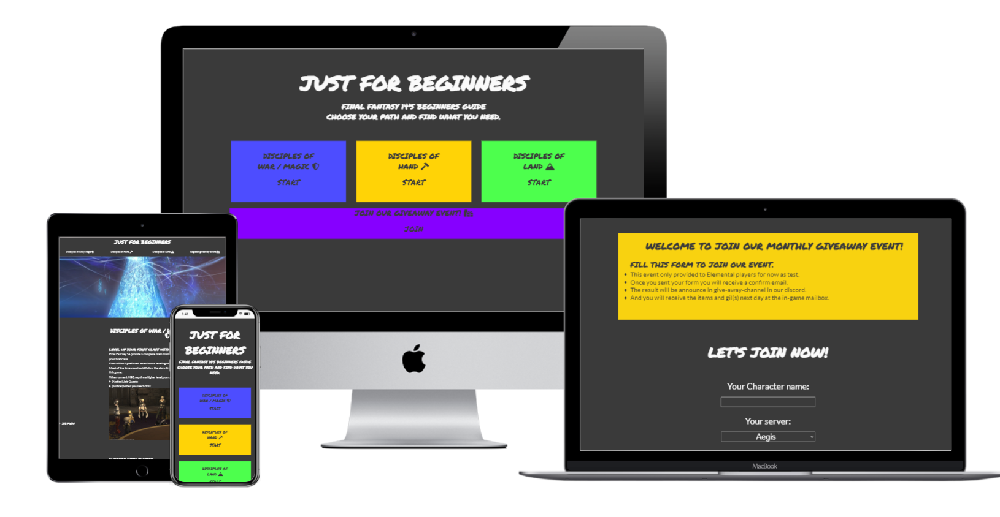

# Just for Begginers - Final Fantasy 14's Beginners Guide
# Milestone Project 1

## =Purpose=
FF14 is one of most well-known MMORPG in thr world. And there are few different FF14 game database and many tools to fulfill their need. But there are too many information prepare to those new players. Instead of 'what I can do', 'what I should do first' are always be the first question to them. Some of them even never play any MMORPG or console game before. So this website will provide a simple guide to help those beginners.

## =Features=
### Existing Features
#### Index
* entrance
  An entrance page to redirect user to other four pages.
* 

#### Guides(doh.html, dow.html, dow.html)

#### Giveaway event register form

### Features Left to Implement
Add a beginners guide in eureka, a up to 144 players instanced area release in 4.0 expansion.
Add a complete gold saucer beginners guide.
Add a house purchasing and furnish guide.

## =Testing=

### Validator Testing

### Unfixed Bugs

## =Deployment=

## =Credits=

### Content

### Media

### Tools
